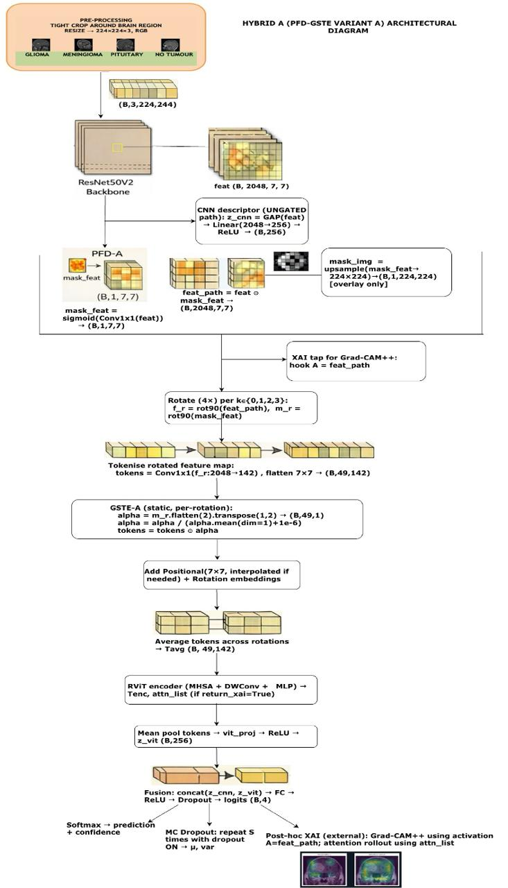
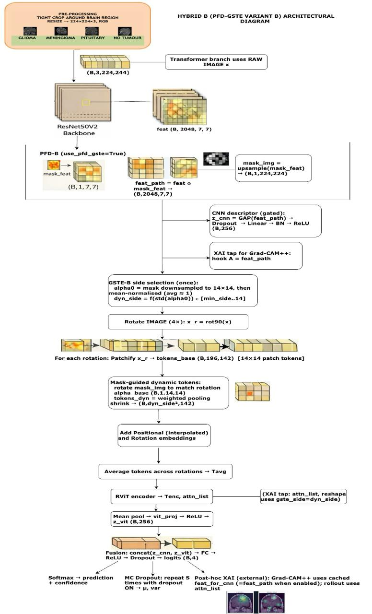
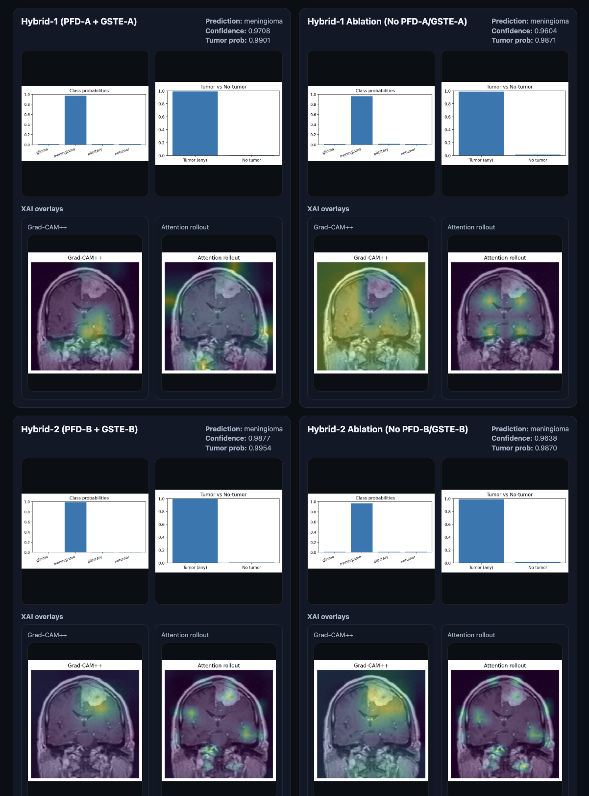

# Pathology-Attentive Hybrid CNN-Transformer for Explainable Brain Tumour MRI Classification
 
**University of Hertfordshire — Department of Computer Science**  
**Programme:** Modular BSc (Hons) Computer Science (Artificial Intelligence)  
**Module:** 6COM2017 – Artificial Intelligence Project  


**Project Title:** Mitigating Shortcut Learning in Brain Tumour Detection and Classification

**Author:** Riya Basak (SRN: 22089065)  
**Supervisor:** Dr Kheng Lee Koay

**THIS IS AN ONGOING PROJECT; THE FYP REPORT IS NOT YET COMPLETE.**


## Problem statement
Brain tumour MRI classifiers can appear accurate while relying on non-tumour shortcuts (artefacts, skull boundaries, acquisition bias). This project builds hybrid CNN–Transformer models with experimental guidance and XAI to encourage tumour-centred reasoning and interpretable outputs.

---

This repository contains a brain tumour MRI classification pipeline with:
- **Offline preprocessing** (leakage-safe SHA1 dedup, tight-crop to 224×224, splits)
- **Four training variants**:
  - Hybrid A (**PFD-A + GSTE-A**)
  - Hybrid B (**PFD-B + GSTE-B**)
  - Ablation: without PFD-A/GSTE-A
  - Ablation: without PFD-B/GSTE-B
- **Explainability (XAI)** outputs (Grad-CAM++ and attention rollout)
- A **demo web app** to run all models on a single uploaded image

---

## Repository structure

```text
.
├── data/
│   ├── raw/brain-tumor-mri-dataset/         # Kaggle dataset folder (downloaded)
│   ├── processed/tightcrop/                  # 224×224 tight-cropped images (generated)
│   └── splits/tightcrop/                     # train.csv / val.csv / test.csv (generated)
├── docs/
│   └── dataset_prep.md                       # notes on preprocessing/audit
├── results/                                  # preprocessing audit outputs + plots + CSV summaries
├── scripts/
│   ├── data.py                               # BrainMRICSV + build_transforms
│   ├── dataset_prep.py                       # OFFLINE preprocessing + leakage-safe dedup + splits
│   ├── dataset_plots.py                      # dataset plots (used by prep pipeline)
│   └── Confusion_metrics_plot_generator.py   # helper plotting utilities
├── Hybrid-model-with-pfdA-gsteA/
│   ├── models/hybrid_model.py
│   ├── train-A.py
│   └── Xai-A.py
├── Hybrid-model-with-pfdB-gsteB/
│   ├── models/hybrid_model.py
│   ├── train-B.py
│   └── Xai-B.py
├── Hybrid-model-without-pfdA-gsteA/
│   ├── models/hybrid_model.py
│   ├── train-without-A.py
│   └── Xai-without-A.py
├── Hybrid-model-without-pfdB-gsteB/
│   ├── models/hybrid_model.py
│   ├── train-without-B.py
│   └── Xai-without-B.py
└── webapp/
    ├── app.py
    ├── models_registry.json
    ├── requirements.txt
    └── templates/index.html

```

## Proposed contributions 
This project introduces two experimental, inspectable guidance modules integrated into a hybrid CNN–Transformer pipeline:

- **PFD (Pathology-Focused Disentanglement):** a learnable soft spatial mask over the CNN’s 7×7 feature map.
- **GSTE (Guided Semantic Token Evolution):** reuses the same mask to steer transformer tokens; Hybrid B can optionally compress tokens toward highlighted regions.

Two guidance strengths are implemented for controlled comparison:
- **Hybrid A:** PFD-A gates only the transformer token pathway; GSTE-A reweights 49 CNN tokens (fixed count).
- **Hybrid B:** PFD-B gates both CNN descriptor + transformer guidance; GSTE-B weights 196 patch tokens and may shrink them to dyn_side² tokens.

---

## Dataset (source and citation)

**Dataset used:** Masoud Nickparvar (2021) Brain Tumor MRI Dataset (4 classes: glioma, meningioma, pituitary, no tumor).  
The project’s code uses the label **`notumor`** for the **no tumor** class.

**reference:**  
Msoud Nickparvar. (2021). Brain Tumor MRI Dataset [Data set]. Kaggle. https://doi.org/10.34740/KAGGLE/DSV/2645886

**Important note (dataset hygiene):**  
The dataset is a combination of multiple sources (figshare, SARTAJ, Br35H). In this project’s dataset curation notes, SARTAJ glioma-class issues were handled by using figshare images instead.

## Preprocessing and splits (executed by `scripts/dataset_prep.py`)

### Goals
1. Remove duplicates (SHA1-based), preventing leakage across Kaggle train/test sources.  
2. Produce a clean **224×224 RGB** dataset using **tight-crop** (tumour-focused framing).  
3. Keep Kaggle’s **Testing** as a held-out test set; create **train/val** from Kaggle Training.

### What the script does (tightcrop pipeline)
- Scans **7023** raw images.
- Computes SHA1 hashes and performs deduplication:
  - **Unique after dedup:** **6726**
  - **Duplicates removed:** **297**
  - Writes duplicate logs into `results/duplicate_files.csv` and `results/duplicate_summary.csv`.
- Audits raw images (geometry/intensity flags):
  - **Total suspect images:** **0**
  - Writes audit CSVs into `results/` (raw stats, resolutions, quality flags, etc.).
- Tight-crop preprocessing:
  - EXIF transpose (if needed)
  - Tight crop with **threshold=5**, **margin=10**
  - Convert to **RGB**
  - Resize to **224×224**
- Writes processed dataset to:
  - `data/processed/tightcrop/{train,val,test}/{class}/`
- Writes split CSVs to:
  - `data/splits/tightcrop/train.csv`
  - `data/splits/tightcrop/val.csv`
  - `data/splits/tightcrop/test.csv`

### Split sizes (Kaggle-aligned, after dedup)
- **Train (from Kaggle Training):** 4353  
- **Val (from Kaggle Training):** 1089  
- **Test (Kaggle Testing):** 1284  

### Per-class counts (from `results/dataset_summary.csv`)
- **Train:** pituitary 1152, notumor 1080, meningioma 1064, glioma 1057  
- **Val:** pituitary 288, notumor 270, meningioma 267, glioma 264  
- **Test:** notumor 381, meningioma 304, pituitary 300, glioma 299 

-----

## Architecture overview

### Hybrid A (PFD-A and GSTE-A)
- Input: RGB 224×224 → normalise → tensor (B, 3, 224, 224)
- ResNet50V2 backbone → `feat` (B, 2048, 7, 7)
- CNN descriptor from **ungated** `feat`
- PFD-A gates features only for transformer tokens
- 7×7 → 49 tokens; GSTE-A reweights tokens (count fixed)
- Rotation handling uses **4 rotations** (0, 90, 180, 270) internally
- RViT-style transformer encoder → pooled token descriptor
- Fusion: concat(CNN descriptor, ViT descriptor) → classifier (4 classes)



### Hybrid B (PFD-B and GSTE-B)
- Same CNN backbone and PFD mask, but:
- CNN descriptor from **gated** `feat_path`
- Transformer uses raw-image patch tokens (14×14 = 196), guided by upsampled/pool mask
- Optional grid shrinking (single side chosen per batch) keeps shapes consistent
- Same fusion and 4-rotation processing pattern



---

## Training protocol

### Data input
Training scripts do **not** call preprocessing. They only read:
- `data/splits/tightcrop/train.csv`
- `data/splits/tightcrop/val.csv`
- `data/splits/tightcrop/test.csv`

Using the dataset loader and transforms:
- `scripts/data.py` → `BrainMRICSV`, `build_transforms`

### Defaults (as coded)
- Epochs: **100**
- Batch size: **32**
- Seed: **42**
- Device: `"cuda"` if available else `"cpu"` (single-GPU logic)
- DataLoader: `num_workers=2`, `pin_memory=True`
  - Hybrid B-style runs use `drop_last=True` on the train loader.

### Augmentation (train only)
- RandomRotation(±15°)
- RandomHorizontalFlip(p=0.5)
- RandomAffine(translate=0.05)
- Optional Gaussian noise (std=0.02, p=0.5)
- Normalise mean=std=(0.5, 0.5, 0.5)

Validation/test:
- ToTensor and Normalise only

### Optimisation + scheduling
- AdamW with **differential learning rates**:
  - CNN LR: `1e-4`
  - Transformer/head LR: `5e-4`
- Selective weight decay:
  - weight_decay = `0.01`
  - **no decay** for biases/norm/1D parameters
- Loss:
  - Train: CrossEntropy(label_smoothing=0.05)
  - Eval: plain CrossEntropy
- Scheduler: CosineAnnealingLR with `eta_min=1e-6`
- Warmup: freeze CNN for **5 epochs**, then unfreeze and **rebuild** optimizer/scheduler
- Gradient clipping: max_norm = **1.0**
- Optional flags:
  - `--amp` mixed precision
  - `--freeze_cnn_bn` freeze CNN BatchNorm stats

### Early stopping and checkpointing
- Monitor: **validation macro-F1**
- Patience: **10**
- Best checkpoint saved as: `best_model.pt`  
  (includes weights + class_names + mean/std + training args + model config)

### Saved artefacts (per run)
- `best_model.pt`
- `history.csv`
- `loss_curves.png`
- `acc_curves.png`
- `confusion_matrix.png`
- `metrics.json`

----

## Results

The table below summarises the final test-set performance for each model variant, using the metrics recorded in each run’s `metrics.json`.

| Model | Test Acc | Macro F1 (test) | Cohen’s Kappa | MCC | Macro Specificity | Best Epoch (val macro-F1) |
|------|----------:|----------------:|--------------:|----:|------------------:|---------------------------:|
| Hybrid A (PFD-A + GSTE-A) | 0.9875 | 0.9875 | 0.9833 | 0.9833 | 0.9959 | 43 |
| Hybrid B (PFD-B + GSTE-B) | 0.9852 | 0.9849 | 0.9802 | 0.9803 | 0.9952 | 14 |
| Without A (Ablation) | 0.9875 | 0.9873 | 0.9833 | 0.9834 | 0.9959 | 30 |
| Without B (Ablation) | 0.9922 | 0.9920 | 0.9896 | 0.9896 | 0.9975 | 42 |

Each model folder contains its own:
- `confusion_matrix.png`
- training curves (loss/accuracy plots)
- `metrics.json`

---

## Explainability (XAI) and uncertainty

The project supports post-hoc explainability and uncertainty estimation:

- **Grad-CAM++** on the CNN feature map  
  Heatmaps are generated using a feature hook at the CNN feature stage (at the **gated feature map** where applicable).

- **Attention rollout** for the transformer branch  
  Rollout is computed from the transformer attention list and mapped back to the token grid for visualization.

- **MC Dropout** at inference  
  Multiple stochastic forward passes are performed with dropout enabled to estimate predictive **mean** and **variance** (uncertainty proxy).


---
### Core stack (training and evaluation)
From the training scripts and preprocessing pipeline, the project uses:
- `torch`, `torchvision`, `timm`
- `numpy`, `pandas`
- `scikit-learn` (confusion matrix, classification report, Cohen’s kappa, MCC)
- `matplotlib`
- `pillow`

### Web app stack (demo)
- `flask`, `numpy`, `pillow`, `matplotlib`, `torch`, `torchvision`, `timm`
 
 ------

## Environment
- **Python:** 3.12.2  (This is what I used)
- **Training platform:** Kaggle (GPU: P100)  
- **Local dev:** macOS (repo preparation and scripts)
- **Platform:** platform: macOS-26.2-arm64-arm-64bit

-----

## Getting started (required: Git LFS for checkpoints)

This repository stores trained model checkpoints (`best_model.pt`) using **Git LFS**.  
If you download the repo as a ZIP, the `.pt` files may not download correctly and the demo app can fail with `FileNotFoundError`.

# Run the Demo Web App (macOS / Linux / Windows)

 ## **Required: Git LFS** (the model checkpoints `*.pt` are stored using Git LFS).  
 **Do NOT use "Download ZIP"** from GitHub — ZIP downloads usually contain **LFS pointer files** (~134 bytes), not the real checkpoints, and the app will fail to load models.
---

## Python version
The demo app was tested on Python 3.12.2 on macOS.  
On some Windows setups, Python 3.11.x may be more reliable because PyTorch and torchvision compatibility depends on available wheels for the platform.

## PyTorch compatibility
Torch wheels differ by OS, CPU/GPU, and Python version. If installing torch or torchvision fails, use PyTorch’s official install command for your platform, then install the remaining packages from webapp/requirements.txt.

> If checkpoint files are missing or unexpectedly small after cloning, run `git lfs pull`.

## macOS
### 1) Install + enable Git LFS (one-time)
```bash
brew install git-lfs
git lfs install
```
### 2) Clone correctly (recommended)
```bash
cd ~/Downloads
git clone https://github.com/AnnyaB/HybridResNet50V2-RViT.git
cd HybridResNet50V2-RViT
```
### 3) Sanity check (must NOT be ~134B)
```bash
ls -lh Hybrid-model-with-pfdA-gsteA/best_model.pt
```

### 4) Run the web app
**Option A (recommended): virtual environment**
```bash
cd webapp
python3 -m venv .venv
source .venv/bin/activate
python -m pip install --upgrade pip
pip install -r requirements.txt
python app.py
```
**Option B (if you insist on your current environment)**
```bash
cd webapp
pip install -r requirements.txt
python app.py
```

---
## Linux (Ubuntu/Debian)
### 1) Install + enable Git LFS (one-time)
```bash
sudo apt update
sudo apt install -y git-lfs
git lfs install
```
### 2) Clone + pull checkpoints
```bash
cd ~/Downloads
git clone https://github.com/AnnyaB/HybridResNet50V2-RViT.git
cd HybridResNet50V2-RViT
```
### 3) Sanity check
```bash
ls -lh Hybrid-model-with-pfdA-gsteA/best_model.pt
```
### 4) Run the web app (venv recommended)
```bash
cd webapp
python3 -m venv .venv
source .venv/bin/activate
python -m pip install --upgrade pip
pip install -r requirements.txt
python app.py
```

---
## Windows (PowerShell)

### Prerequisites
This repository is private. You must have an approved GitHub account with access to it before cloning.

### 1) Install Python 3.11
winget install --id Python.Python.3.11 -e
winget upgrade --id Python.Python.3.11

### 2) Install Git
winget install --id Git.Git -e

### 3) Install Git LFS
winget install --id GitHub.GitLFS -e
git lfs install

### 4) Check that Git and Python are available
git --version
git lfs version
py -3.11 --version

### 5) Create a project folder and clone the repository
mkdir $env:USERPROFILE\ai_project
cd $env:USERPROFILE\ai_project
git clone https://github.com/AnnyaB/HybridResNet50V2-RViT.git
cd HybridResNet50V2-RViT

### 6) Check that a model checkpoint exists
dir Hybrid-model-with-pfdA-gsteA\best_model.pt


### 7) Run the demo web app
cd webapp
py -3.11 -m venv .venv

Set-ExecutionPolicy -Scope Process -ExecutionPolicy Bypass
.\.venv\Scripts\Activate.ps1

python -m pip install --upgrade pip
pip install -r requirements.txt

### 8) Start the demo app
python app.py
---
### app.py starts the local Flask demo web application for model inference and visualisation. It does not train or test the models.

## Dependencies

> Demo web app: install only `webapp/requirements.txt`

>  Training / preprocessing: use the root requirements `requirements.txt` (or a separate environment)


## Then **open**:

http://127.0.0.1:5000

## Demo Web App Screenshot




**Note on the timm warning**

If you see a timm warning about a “deprecated model name mapping”, it is **not an error**.
It means a model alias name was remapped internally, but the model can still **load and run normally**.

## References 

Bolya, D., Fu, C., Dai, X., Zhang, P., Feichtenhofer, C. and Hoffman, J. (2022) Token merging: Your ViT but faster. arXiv preprint.
doi:https://doi.org/10.48550/arXiv.2210.09461 (Accessed: 6 February 2026).

He, K., Zhang, X., Ren, S. and Sun, J. (2016) ‘Identity mappings in deep residual networks’
, European Conference on Computer Vision, pp. 630–645.
doi:https://doi.org/10.1007/978-3-319-46493-038 (Accessed: 6 February 2026).

Hugging Face (2019) timm/resnetv2_50x1_bit.goog_in21k_ft_in1k [Pretrained model weights]. Hugging Face Model Hub. Available at: https://huggingface.co/timm/resnetv2_50x1_bit.goog_in21k_ft_in1k (Accessed: 14 February 2026).

Kleinberg, J. and Tardos, E. (2006) Algorithm design. 1st edn. Boston, MA: Pearson Education / Addison-Wesley. ISBN: 0-321-29535-8 (Accessed: 6
February 2026).

Kolesnikov, A. et al. (2020) ‘Big Transfer (BiT): General visual representation learning’
, European Conference on Computer Vision.
doi:https://doi.org/10.48550/arXiv.1912.11370 (Accessed: 6 February 2026).

Krishnan, P.T., Krishnadoss, P., Khandelwal, M., Gupta, D., Nihaal, A. and Kumar, T.S. (2024) ‘Enhancing brain tumor detection in MRI with a rotation
invariant Vision Transformer’
, Frontiers in Neuroinformatics, 18, 1414925. doi:https://doi.org/10.3389/fninf.2024.1414925 (Accessed: 6 February 2026).

Rao, Y. et al. (2021) ‘DynamicViT: Efficient vision transformers with dynamic token sparsification’
, Advances in Neural Information Processing Systems.
doi:https://doi.org/10.48550/arXiv.2106.02034 (Accessed: 6 February 2026).

Sarada, B., Reddy, K.N., Muktisingh, R., Babu, R. and Babu, B.S.S.V.R. (2025) ‘Brain tumor classification using modified ResNet50V2 deep learning
model’
, International Journal of Computing and Digital Systems, 17(1), pp. 1–11. doi:https://doi.org/10.12785/ijcds/1571021750 (Accessed: 6 February
2026).

Xia, T., Chartsias, A. and Tsaftaris, S.A. (2020) ‘Pseudo-healthy synthesis with pathology disentanglement and adversarial learning’
, Medical Image
Analysis, 64, 101719. doi:https://doi.org/10.1016/j.media.2020.101719 (Accessed: 6 February 2026).


## Licensing and medical disclaimer

### Private academic license (All Rights Reserved)

This repository is provided under a **Private Academic / All Rights Reserved** arrangement for **assessment and supervision only**.  
Access is granted only to **approved viewers**. No part of this repository may be redistributed, copied, or used outside the scope of academic evaluation without explicit permission from the owner. **DO NOT** make any changes in the repository. 

### Medical disclaimer

This software is for **research and educational use only**.  
It is **not** a certified medical device and **must not** be used for clinical diagnosis, patient management, or treatment decisions. Any outputs produced by this code are strictly experimental and may be incorrect.

### Contact

For access requests or questions related to this private repository, contact: **rb23ack@herts.ac.uk**, alternative: riyabasak639@gmail.com
