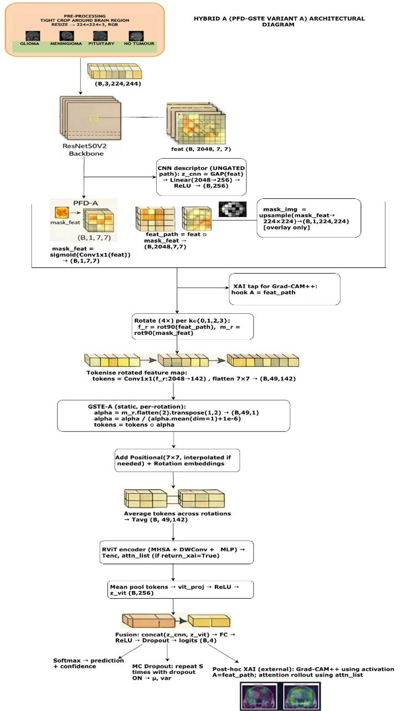
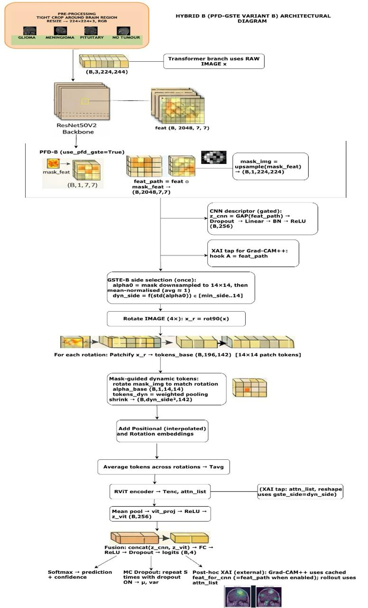
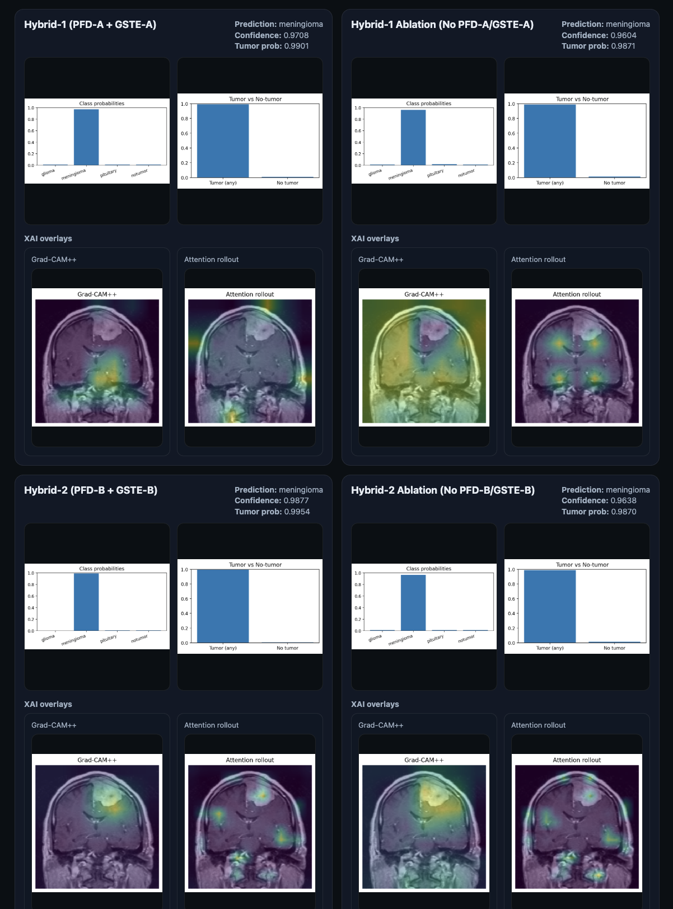

<a id="top"></a>

<div align="center">

<h1>Mitigating Shortcut Learning in Brain Tumour MRI Classification</h1>

<p><strong>PFD–GSTE: experimental pathology-guided ResNet50V2–RViT hybrids</strong></p>

<p>
  Riya Basak · BSc (Hons) Computer Science (Artificial Intelligence)<br>
  Department of Computer Science · University of Hertfordshire
</p>

<p>
  <a href="https://github.com/AnnyaB/HybridResNet50V2-RViT/actions/workflows/tests.yml"></a>
  <a href="https://pypi.org/project/pfd-gste/"></a>
  
  
  <a href="LICENSE"></a>
</p>

<p>
  <a href="https://annyab.github.io/pfd-gste-research-article/"><strong>Research article</strong></a>
  ·
  <a href="https://annyab.github.io/pfd-gste-research-article/dataviz/">Interactive results</a>
  ·
  <a href="https://huggingface.co/spaces/AnnyaaB/brain-tumour-pfd-gste-demo">Live demo</a>
  ·
  <a href="https://annyab.github.io/pfd-gste-research-article/mitigating-shortcut-learning-in-brain-tumour-mri-classification.pdf">FYP report</a>
  ·
  <a href="#citation">Citation</a>
</p>

</div>

---

## Overview

Brain tumour MRI classifiers can achieve high held-out accuracy while relying on acquisition artefacts, skull boundaries, background patterns, or other non-tumour shortcuts. This project evaluates whether learned spatial guidance can alter the evidence used by a hybrid CNN–Transformer without requiring tumour segmentation masks.

The repository implements two project-specific modules:

- **Pathology-Focused Disentanglement (PFD):** a learned one-channel soft spatial gate inferred from CNN features.
- **Guided Semantic Token Evolution (GSTE):** mean-normalised spatial guidance applied to transformer-facing feature or patch tokens.

Two guided hybrids are evaluated against matched unguided controls. The principal result is deliberately reported without promotional simplification:

> [!IMPORTANT]
> **Ablation B is the strongest classifier** on the fixed held-out test set, reaching 99.22% accuracy and 0.9920 macro-F1. **Hybrid B shows the strongest Grad-CAM++ localisation in the three selected qualitative cases**, with 3/3 judgements marked correct. These findings indicate a classification–localisation tension; they do not prove that PFD–GSTE improves accuracy or eliminates shortcut learning.

## Research at a glance

| Item | Verified project setting |
| --- | --- |
| Programme | Modular BSc (Hons) Computer Science (Artificial Intelligence) |
| Module | 6COM2017 — Artificial Intelligence Project |
| Supervisor | Dr Kheng Lee Koay |
| Second marker | Dr Khashayar Ghamati Ghamsari |
| Task | Four-class brain tumour MRI classification |
| Classes | glioma, meningioma, pituitary, `notumor` |
| Input | 224 × 224 RGB MRI images |
| Curated dataset | 6,726 unique images after exact SHA-1 deduplication |
| Held-out test set | 1,284 images |
| Model family | ResNet50V2 + rotation-aware Vision Transformer + late fusion |
| Evaluated variants | Hybrid A, Hybrid B, Ablation A, Ablation B |
| Explainability | Grad-CAM++ and Attention Rollout |
| Stochastic analysis | MC Dropout with 20 inference passes |
| Research status | Final-year project; not peer-reviewed clinical validation |

## Contributions

1. **Exact-duplicate-aware preprocessing** with SHA-1 auditing, tight cropping, deterministic split generation, and machine-readable summaries.
2. **Two pathology-guidance designs** spanning CNN-feature tokens and raw-image patch tokens.
3. **Matched ablations** that retain negative evidence rather than presenting the guided model as the classification winner.
4. **Branch-specific inspection** using Grad-CAM++ for CNN evidence and Attention Rollout for transformer evidence.
5. **Open research artefacts:** source code, trained checkpoints, reusable PyPI package, browser demo, report, research article, figures, and result tables.

The PFD and GSTE names are project-specific. PFD learns a soft preference map; it is not a supervised tumour segmenter and should not be interpreted as a clinically validated pathology model.

## Architecture

<p align="center">
  
  
</p>

| Property | Hybrid A | Hybrid B |
| --- | --- | --- |
| Initial transformer tokens | 49 CNN feature tokens | 196 raw-image patch tokens |
| CNN descriptor | Computed from ungated features | Computed from PFD-gated features |
| Guidance reach | Transformer-facing pathway | CNN and transformer pathways |
| Token count | Fixed | Optional concentration-aware shrinking |
| Trainable parameters | 26.68M | 26.58M |

Because A and B differ in token source and guidance reach, cross-family comparisons do not isolate one design factor. The strongest controlled comparisons are **Hybrid A vs Ablation A** and **Hybrid B vs Ablation B**.

## Verified results

All values below are from the fixed 1,284-image held-out test set.

| Model | Parameters | Accuracy | Macro-F1 | Test loss | Specificity | Cohen’s κ | MCC | Errors | Best epoch |
| --- | ---: | ---: | ---: | ---: | ---: | ---: | ---: | ---: | ---: |
| Hybrid A | 26.68M | 98.75% | 0.9875 | 0.0803 | 0.9959 | 0.9833 | 0.9833 | 16 | 43 |
| Hybrid B | 26.58M | 98.52% | 0.9849 | 0.0753 | 0.9952 | 0.9802 | 0.9803 | 19 | 14 |
| Ablation A | 26.68M | 98.75% | 0.9873 | 0.0847 | 0.9959 | 0.9833 | 0.9834 | 16 | 30 |
| **Ablation B** | **26.58M** | **99.22%** | **0.9920** | **0.0668** | **0.9975** | **0.9896** | **0.9896** | **10** | **42** |

Within the B family, Hybrid B is 0.70 percentage points lower in accuracy and 0.71 percentage points lower in macro-F1 than Ablation B. The repository therefore makes no claim that guidance improved classification.

### Qualitative evidence-location audit

| Model | Held-out accuracy | Grad-CAM++ cases marked correct |
| --- | ---: | ---: |
| Hybrid A | 98.75% | 0/3 |
| **Hybrid B** | 98.52% | **3/3** |
| Ablation A | 98.75% | 1/3 |
| **Ablation B** | **99.22%** | 1/3 |

The localisation column covers only three selected report cases. It is not a full-test localisation metric, segmentation score, or proof of causal faithfulness. The project has no tumour masks, Dice/IoU scores, pointing-game evaluation, or saliency randomisation study.

Explore the committed results through the [web-native research article](https://annyab.github.io/pfd-gste-research-article/) and [interactive visualisations](https://annyab.github.io/pfd-gste-research-article/dataviz/).

## Installation

The full repository uses Python 3.12. Trained `.pt` checkpoints are tracked with Git LFS.

```bash
git lfs install
git clone https://github.com/AnnyaB/HybridResNet50V2-RViT.git
cd HybridResNet50V2-RViT
git lfs pull

python3.12 -m venv .venv
source .venv/bin/activate
python -m pip install --upgrade pip
python -m pip install -r requirements.txt
python -m pip install -e ".[test]"
python -m pytest -q
```

On Windows PowerShell, activate the environment with:

```powershell
.\.venv\Scripts\Activate.ps1
```

If PyTorch installation fails, install the build appropriate for the operating system and accelerator using the official [PyTorch installation selector](https://pytorch.org/get-started/locally/), then install the remaining requirements.

## Data preparation

### Dataset

- **Source:** Masoud Nickparvar, *Brain Tumor MRI Dataset* (2021)
- **Dataset DOI:** [10.34740/KAGGLE/DSV/2645886](https://doi.org/10.34740/KAGGLE/DSV/2645886)
- **Expected location:** `data/raw/brain-tumor-mri-dataset/`

The dataset is not redistributed by this repository. Download it under its original terms and place it at the expected location.

```text
data/
└── raw/
    └── brain-tumor-mri-dataset/
```

Run preprocessing once from the repository root:

```bash
python scripts/dataset_prep.py
```

The script writes processed images, split CSVs, and audit outputs:

```text
data/
├── processed/tightcrop/{train,val,test}/{class}/
└── splits/tightcrop/
    ├── train.csv
    ├── val.csv
    └── test.csv

results/
```

### Preprocessing audit

| Audit item | Value |
| --- | ---: |
| Raw images scanned | 7,023 |
| Unique images after exact SHA-1 deduplication | 6,726 |
| Exact duplicates removed | 297 |
| Suspect/corrupt images reported | 0 |
| Crop | Tight crop, threshold 5, margin 10 |
| Output | 224 × 224 RGB |

| Split | glioma | meningioma | pituitary | `notumor` | Total |
| --- | ---: | ---: | ---: | ---: | ---: |
| Train | 1,057 | 1,064 | 1,152 | 1,080 | 4,353 |
| Validation | 264 | 267 | 288 | 270 | 1,089 |
| Test | 299 | 304 | 300 | 381 | 1,284 |
| **Total** | **1,620** | **1,635** | **1,740** | **1,731** | **6,726** |

> [!NOTE]
> SHA-1 deduplication removes byte-identical copies and reduces exact-copy leakage. Without patient identifiers or a validated near-duplicate audit, it does not establish patient-level independence or rule out visually near-identical images.

## Training

Training scripts consume the precomputed CSVs and do not invoke preprocessing automatically.

```bash
# Guided models
python Hybrid-model-with-pfdA-gsteA/train-A.py
python Hybrid-model-with-pfdB-gsteB/train-B.py

# Matched unguided controls
python Hybrid-model-without-pfdA-gsteA/train-without-A.py
python Hybrid-model-without-pfdB-gsteB/train-without-B.py
```

Mixed precision can be enabled where supported:

```bash
python Hybrid-model-with-pfdA-gsteA/train-A.py --amp
```

### Reported training protocol

| Setting | Value |
| --- | --- |
| Reference environment | Python 3.12.2; Kaggle Tesla P100 |
| Epoch budget | 100 |
| Batch size | 32 |
| Seed | 42 |
| Optimiser | AdamW |
| CNN learning rate | `1e-4` |
| Transformer/fusion learning rate | `5e-4` |
| Weight decay | `0.01` |
| Training loss | Cross-entropy with label smoothing `0.05` |
| Scheduler | Cosine annealing, minimum LR `1e-6` |
| Warm-up | CNN frozen for 5 epochs |
| Gradient clipping | Maximum norm `1.0` |
| Checkpoint selection | Best validation macro-F1 |
| Early-stopping patience | 10 |

Hybrid B-family loaders use `drop_last=True` while A-family loaders do not. This difference is disclosed because it limits clean causal interpretation across families.

Each run writes a checkpoint, history, curves, confusion matrix, and `metrics.json`.

## Explainability and uncertainty

Run the model-specific analysis scripts after the corresponding checkpoint is available:

```bash
python Hybrid-model-with-pfdA-gsteA/Xai-A.py
python Hybrid-model-with-pfdB-gsteB/Xai-B.py
python Hybrid-model-without-pfdA-gsteA/Xai-without-A.py
python Hybrid-model-without-pfdB-gsteB/Xai-without-B.py
```

- **Grad-CAM++** interrogates the CNN branch.
- **Attention Rollout** inspects transformer token evidence.
- **MC Dropout** estimates predictive mean and variation across 20 stochastic passes.

MC Dropout variation is not a calibration metric. Expected calibration error, Brier score, reliability diagrams, and temperature scaling were not reported.

## Inference and demo

### Browser demo

The public research demo loads all four variants and accepts one MRI image:

**[Open the Hugging Face Space](https://huggingface.co/spaces/AnnyaaB/brain-tumour-pfd-gste-demo)**

It returns class probabilities and qualitative explanation overlays where the model exposes the required activations and attention values.

### Local Flask demo

Confirm that Git LFS downloaded real checkpoints rather than pointer files:

```bash
git lfs pull
ls -lh Hybrid-model-with-pfdA-gsteA/best_model.pt
```

Start the app:

```bash
cd webapp
python3.12 -m venv .venv
source .venv/bin/activate
python -m pip install --upgrade pip
python -m pip install -r requirements.txt
python app.py
```

Open [http://127.0.0.1:5000](http://127.0.0.1:5000).

<p align="center">
  
</p>

The demo is a qualitative inspection interface, not the training/evaluation pipeline. Outputs can differ across package versions, hardware kernels, and stochastic MC-Dropout passes.

## Released checkpoints

| Variant | Hugging Face model repository |
| --- | --- |
| Hybrid A — PFD-A + GSTE-A | [brain-tumour-pfd-gste-hybrid-a](https://huggingface.co/AnnyaaB/brain-tumour-pfd-gste-hybrid-a) |
| Hybrid B — PFD-B + GSTE-B | [brain-tumour-pfd-gste-hybrid-b](https://huggingface.co/AnnyaaB/brain-tumour-pfd-gste-hybrid-b) |
| Ablation A | [brain-tumour-pfd-gste-ablation-a](https://huggingface.co/AnnyaaB/brain-tumour-pfd-gste-ablation-a) |
| Ablation B | [brain-tumour-pfd-gste-ablation-b](https://huggingface.co/AnnyaaB/brain-tumour-pfd-gste-ablation-b) |

Checkpoint metadata uses the class order:

```text
glioma → meningioma → pituitary → notumor
```

The model repositories do not redistribute the benchmark dataset.

## Reusable `pfd-gste` package

The reusable guidance components are published as an alpha research package for Python `>=3.12,<3.13`:

```bash
python -m pip install pfd-gste
```

```python
from pfd_gste import PFDGSTEVariantA, PFDGSTEVariantB
```

| Public component | Purpose |
| --- | --- |
| `PFDGSTEVariantA` | Guidance for transformer tokens derived from CNN feature maps |
| `PFDGSTEVariantB` | CNN gating and guidance for raw-image patch tokens |
| `PathologyFocusedGate` | Standalone learned soft spatial gate |
| `mc_dropout_predict` | MC-Dropout inference helper |

The PyPI distribution contains the reusable guidance modules only. It does not include the dataset, full classifiers, checkpoints, experimental results, or Flask application.

## Repository structure

```text
HybridResNet50V2-RViT/
├── pfd_gste/                         # Reusable guidance package
├── scripts/                          # Data loading, preprocessing, and plotting
├── Hybrid-model-with-pfdA-gsteA/     # Guided A model, training, XAI, checkpoint
├── Hybrid-model-with-pfdB-gsteB/     # Guided B model, training, XAI, checkpoint
├── Hybrid-model-without-pfdA-gsteA/  # Matched A-family control
├── Hybrid-model-without-pfdB-gsteB/  # Matched B-family control
├── webapp/                           # Local Flask research demo
├── docs/                             # Dataset notes and figures
├── results/                          # Audit, metrics, plots, and evaluations
├── Misclassified-results/            # Saved error-analysis artefacts
├── tests/                            # Reusable-package tests
├── CITATION.cff
├── CITATION.bib
├── pyproject.toml
└── requirements.txt
```

## Reproducibility and evidence boundary

| Area | Available evidence | Current limitation |
| --- | --- | --- |
| Code | Four model variants, preprocessing, training, XAI, demo, package | Scripts are variant-specific rather than one unified experiment runner |
| Data curation | Exact SHA-1 audit and fixed CSV splits | No patient IDs or validated near-duplicate audit |
| Classification | Fixed held-out metrics and confusion matrices | One reported seed per variant; no confidence intervals |
| Localisation | Three selected qualitative cases | No masks or quantitative localisation benchmark |
| Uncertainty | Twenty-pass MC Dropout examples | No formal calibration analysis |
| Generalisation | Five-image qualitative meningioma demonstration | No external four-class clinical validation |
| Clinical status | Research and educational use | Not a medical device or clinical decision system |

The small external meningioma sample is a qualitative demonstration only. Its five images do not constitute external validation.

## Research artefacts

| Artefact | Link |
| --- | --- |
| Web-native research article | [annyab.github.io/pfd-gste-research-article](https://annyab.github.io/pfd-gste-research-article/) |
| Interactive result explorers | [Article visualisations](https://annyab.github.io/pfd-gste-research-article/dataviz/) |
| Full project report | [Download the 58-page FYP report](https://annyab.github.io/pfd-gste-research-article/mitigating-shortcut-learning-in-brain-tumour-mri-classification.pdf) |
| Local research note | [`Research_Note.pdf`](Research_Note.pdf) |
| Citation metadata | [`CITATION.cff`](CITATION.cff) · [`CITATION.bib`](CITATION.bib) |
| Package metadata | [`pyproject.toml`](pyproject.toml) |
| Dataset-preparation implementation | [`scripts/dataset_prep.py`](scripts/dataset_prep.py) |

## Citation

If this repository, trained models, or PFD–GSTE modules support your work, use the machine-readable [`CITATION.cff`](CITATION.cff) or [`CITATION.bib`](CITATION.bib):

```text
Basak, R. (2026). Mitigating Shortcut Learning in Brain Tumour MRI Classification.
BSc Artificial Intelligence Project, University of Hertfordshire.
https://github.com/AnnyaB/HybridResNet50V2-RViT
```

## Licence

The code is released under the [MIT License](LICENSE). Dataset, pretrained-backbone, third-party-code, and model-hosting terms remain governed by their respective sources.

## Medical disclaimer

This software and its outputs are for research and educational use only. They are not a certified medical device and must not be used for clinical diagnosis, patient management, or treatment decisions. Predictions and visual explanations may be incorrect.

## Contact and contributions

For reproducibility questions, defects, or proposed improvements, please [open a GitHub issue](https://github.com/AnnyaB/HybridResNet50V2-RViT/issues). Contributions should preserve the reported negative ablation result, evidence limitations, attribution, and medical disclaimer.

---

<p align="center">
  <strong>Evidence before claims · Reproducibility before promotion · Research use only</strong><br>
  <a href="#top">Back to top</a>
</p>
